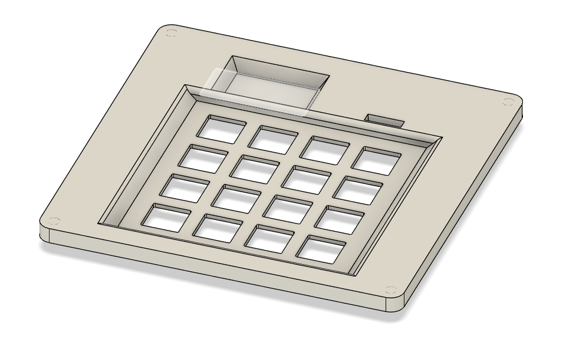
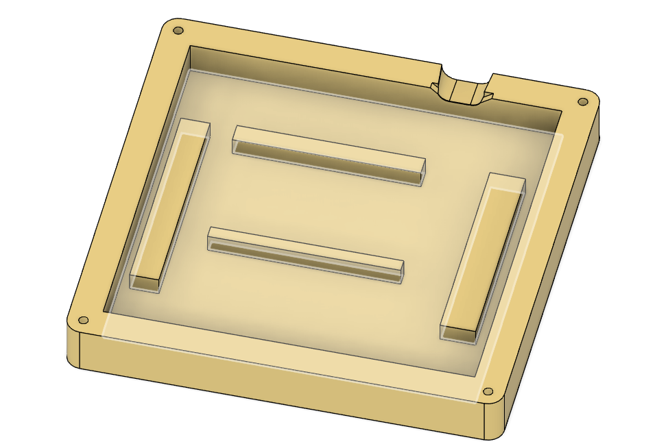
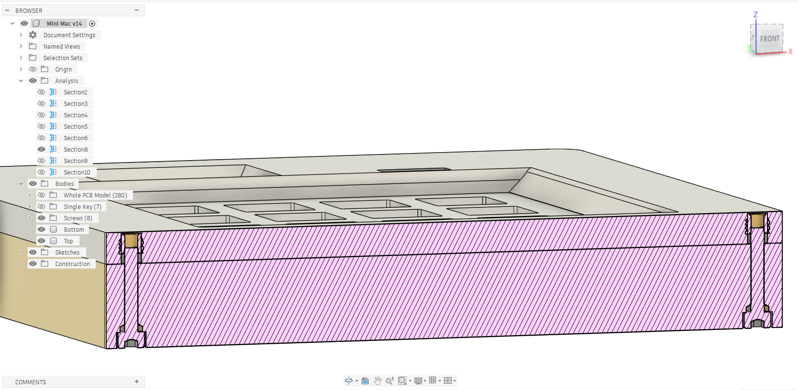
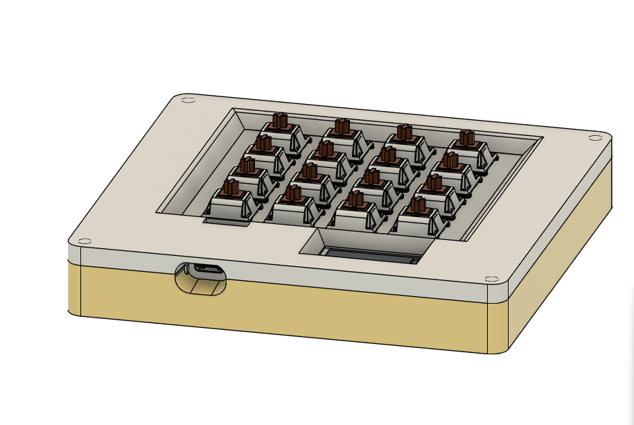

# MiniMac
Presenting Mini Mac.   This is an external keypad to serve as functions that my current keyboard uses function keys for, like screenshot, which is (fn + u).   This project will serve as a huge productivity upgrade.

## Features
-128x32 OLED Display
-16 Keyswitches

## Note

I am also requesting a grant for a soldering iron (obviously with solder) for this project from Hack Club.

## Cad Model

I used heatset inserts and M3x16mm screws for the case. 

It has a simple Top and Bottom. The PCB sits in the middle.

This image displays the full model with the PCB inside.

Made in Fusion360.

## PCB

My PCB was made in KiCad

Schematic

PCB

## Firmware

This HackPad uses [QMK](https://qmk.fm/) firmware.

I intend to change the keys occasionally.

## BOM

Bill of Materials:

- 16x Cherry MX Switches
- 16x DSA Keycaps
- 4x Heatset Inserts
- 4x M3x16mm Screws
- 16x Through-Hole 1N4148 Diodes
- 1x 0.91-inch OLED Display
- 1x unsoldered Seeed XIAO RP2040
- 1x 3D Printed Case with two parts (Top and Bottom)

